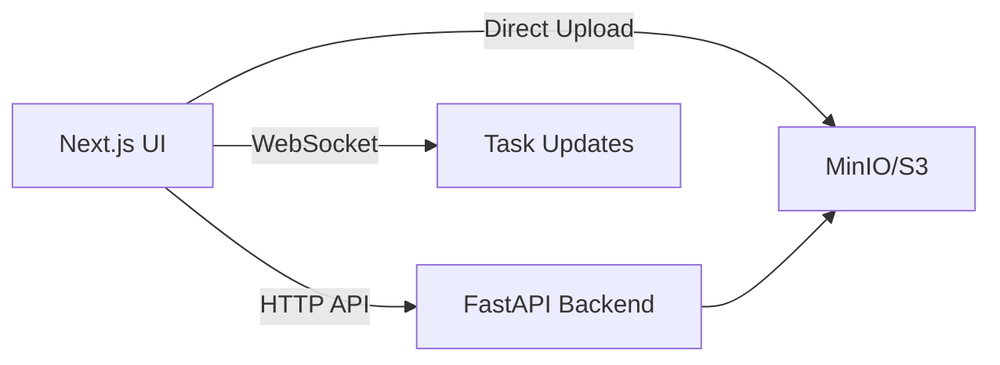

# AI Audio/Video Content Assistant


[中文](#概览) | [English](#overview)

## Overview
AI-powered audio/video understanding assistant that turns files or YouTube links into structured insights (summary, key points, action items) with real-time progress.

## 概览
面向音视频内容理解的 AI 助手：支持本地上传或 YouTube 链接，一键生成结构化摘要/要点/待办，并提供实时进度更新。

## Features / 核心特性（前端视角）
- Auth-first UI：登录态驱动导航与页面访问，OAuth 按钮与会话保持
- Upload UX：文件格式校验、哈希计算、直传进度条、秒传提示与失败重试
- YouTube 入口：链接校验与任务创建，统一入口体验
- Task Dashboard：任务列表、筛选、状态徽章、失败重试与清理提示
- Detail View：时间轴转写、摘要分区、关键要点/行动项展示
- Real-time Feedback：WebSocket 进度推送，状态实时刷新
- i18n UI：中英文切换、统一文案与错误提示展示

## Screenshots / 关键截图
> 将截图放入 `public/screenshots/` 后替换下面路径
- 登录页（OAuth 入口与引导文案）
  - `public/screenshots/login.png`
- 任务列表（筛选、状态、重试入口）
  - `public/screenshots/tasks.png`
- 任务详情（转写/摘要/要点）
  - `public/screenshots/task-detail.png`
- 上传流程（进度与错误提示）
  - `public/screenshots/upload.png`

## Architecture / 架构与数据流（前端视角）


## Tech Stack / 技术栈
- Next.js 14 + TypeScript + Tailwind + shadcn/ui
- Auth.js (NextAuth v5)
- Vitest + Testing Library

## Quick Start / 本地启动
```bash
npm install
npm run dev
```
Open http://localhost:3000

## Environment / 环境变量
参考 `.env.example`（建议复制为 `.env.local`）。

| 变量名 | 说明 | 示例 |
| --- | --- | --- |
| `AUTH_SECRET` | Auth.js 密钥 | `xxxxx` |
| `AUTH_GOOGLE_ID` | Google OAuth Client ID | `xxxxx` |
| `AUTH_GOOGLE_SECRET` | Google OAuth Secret | `xxxxx` |
| `AUTH_GITHUB_ID` | GitHub OAuth Client ID | `xxxxx` |
| `AUTH_GITHUB_SECRET` | GitHub OAuth Secret | `xxxxx` |
| `NEXT_PUBLIC_APP_URL` | 前端访问地址 | `http://localhost:3000` |

## Docs / 文档
- `docs/README.md`：文档入口
- `docs/PRD.md` / `docs/ARCH.md`：产品与架构说明
- `docs/API.md`：接口契约

## Scripts / 常用命令
- `npm run dev`：本地开发
- `npm run lint`：代码检查
- `npm run test`：单元测试

## Contributing / 贡献指南
见 `CONTRIBUTING.md`。

## Changelog / 版本变更
见 `CHANGELOG.md`。

## Roadmap / 路线图
见 `ROADMAP.md`。

## License
MIT

## Getting Started

First, run the development server:

```bash
npm run dev
# or
yarn dev
# or
pnpm dev
# or
bun dev
```

Open [http://localhost:3000](http://localhost:3000) with your browser to see the result.

You can start editing the page by modifying `app/page.tsx`. The page auto-updates as you edit the file.

This project uses [`next/font`](https://nextjs.org/docs/app/building-your-application/optimizing/fonts) to automatically optimize and load [Geist](https://vercel.com/font), a new font family for Vercel.

## Learn More

To learn more about Next.js, take a look at the following resources:

- [Next.js Documentation](https://nextjs.org/docs) - learn about Next.js features and API.
- [Learn Next.js](https://nextjs.org/learn) - an interactive Next.js tutorial.

You can check out [the Next.js GitHub repository](https://github.com/vercel/next.js) - your feedback and contributions are welcome!

## Deploy on Vercel

The easiest way to deploy your Next.js app is to use the [Vercel Platform](https://vercel.com/new?utm_medium=default-template&filter=next.js&utm_source=create-next-app&utm_campaign=create-next-app-readme) from the creators of Next.js.

Check out our [Next.js deployment documentation](https://nextjs.org/docs/app/building-your-application/deploying) for more details.
