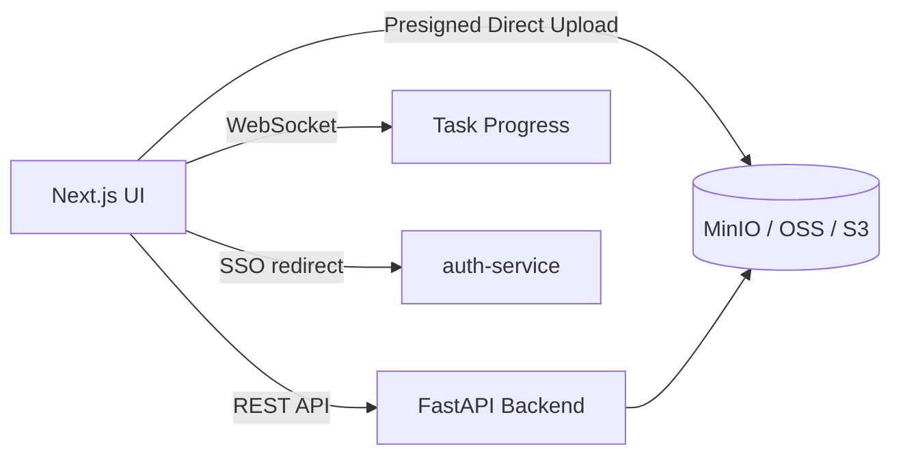

# AI Audio/Video Content Assistant — Frontend


[English](#overview) | [中文](#概览)

前端仓库：面向音视频内容理解的 AI 助手 UI。后端是独立的 FastAPI 仓库（`ai-audio-assistant-web`），本仓只负责界面、OAuth 登录流、文件哈希与 S3 直传。

---

## Overview

AI-powered audio/video understanding assistant that turns uploaded files or YouTube links into structured insights — timestamped transcript, structured summary, key points and action items — with real-time progress. This repository is the **Next.js frontend only**; business logic (ASR/LLM, storage, database) lives in the separate FastAPI backend.

## 概览

把上传的音视频文件或 YouTube 链接，转成结构化理解——带时间戳的转写、结构化摘要、关键要点与待办，并实时推送进度。本仓库仅为 **Next.js 前端**；ASR/LLM、存储、数据库等业务逻辑在独立的 FastAPI 后端。

## Features / 核心特性（前端视角）

- **登录与会话**：经共享 SSO 登录（Google/GitHub 由 auth-service 承担），登录态驱动导航与受保护路由。
- **上传 UX**：格式校验、客户端 SHA256 计算、预签名直传 S3、秒传提示与失败重试。
- **YouTube / 发现页**：粘贴链接转写；`/discover` 关键词搜索 + 热门推荐，对「已有转写」的结果感知并跳转。
- **公开广场 `/explore`**：匿名可浏览公开任务。
- **任务面板**：列表、筛选、状态徽章、失败重试与清理。
- **详情视图**：时间轴转写、分区摘要、关键要点 / 行动项、AI 配图。
- **实时反馈**：WebSocket 进度推送，断线自动重连并降级为 HTTP 轮询。
- **转写内搜索**：基于后端全文检索（关键词/字面），命中片段高亮并可深链到时间点。
- **管理后台 `/admin`**：屏蔽频道复核、成本看板等（受权限门控）。
- **i18n**：中英文切换，错误文案由后端本地化后直显。

## Tech Stack / 技术栈

- **Next.js 16**（App Router）+ **React 19** + **TypeScript 5**
- **Tailwind CSS v4** + **shadcn/ui** + Radix UI
- **Auth**：共享 SSO SDK [`auth-client-web`](https://github.com/HyxiaoGe/auth-client-web)（重定向到 auth-service 完成 Google/GitHub OAuth，令牌存 localStorage）。> 注：`next-auth` 仍在 `package.json` 中但为**历史残留依赖**，主认证流程不经 NextAuth。
- **状态管理**：Zustand
- **实时**：WebSocket
- **测试**：Vitest + Testing Library
- **主题**：next-themes（明/暗）

## Quick Start / 本地启动

```bash
npm install
cp .env.example .env.local   # 按需填写
npm run dev
```

打开 http://localhost:3000

> 需配合后端（`ai-audio-assistant-web`，默认 `http://localhost:8088`）与 auth-service（默认 `http://localhost:8100`）一起运行。

## Environment / 环境变量

复制 `.env.example` 为 `.env.local` 后按需调整。所有前端可见变量均以 `NEXT_PUBLIC_` 开头。

| 变量名 | 说明 | 示例 |
| --- | --- | --- |
| `NEXT_PUBLIC_APP_URL` | 前端访问地址 | `http://localhost:3000` |
| `NEXT_PUBLIC_API_BASE_URL` | 后端 API 基址 | `http://localhost:8088/api/v1` |
| `NEXT_PUBLIC_API_URL` | 后端源站（WebSocket / 媒体） | `http://localhost:8088` |
| `NEXT_PUBLIC_AUTH_URL` | auth-service 地址 | `http://localhost:8100` |
| `NEXT_PUBLIC_AUTH_CLIENT_ID` | 本应用在 auth-service 注册的 client id | `app_your_client_id` |

## Scripts / 常用命令

| 命令 | 说明 |
| --- | --- |
| `npm run dev` | 本地开发（localhost:3000） |
| `npm run build` | 生产构建 |
| `npm run start` | 启动生产构建 |
| `npm run lint` | ESLint（`eslint src`） |
| `npm run test` | 单元测试（`vitest run`） |
| `npx tsc --noEmit` | 类型检查 |

Pre-commit（husky + lint-staged）会在提交时对暂存文件自动跑 ESLint。

## Architecture / 架构与数据流（前端视角）


```mermaid
flowchart LR
  UI[Next.js UI] -->|REST API| BE[FastAPI Backend]
  UI -->|WebSocket| WS[Task Progress]
  UI -->|Presigned Direct Upload| S3[(MinIO / OSS / S3)]
  UI -->|SSO redirect| AUTH[auth-service]
  BE --> S3
```

前端职责：界面、OAuth 登录流、客户端文件哈希、S3 直传、展示后端错误。前端**不**校验 JWT、不生成预签名、不直连 ASR/LLM、不做数据库操作。

## Project Structure / 目录结构

```
src/
├── app/
│   ├── (auth)/login     # 登录页（公开）
│   ├── auth/callback    # SSO 回调（公开）
│   ├── (main)/          # 受保护路由（tasks / explore / discover / admin / settings / stats ...）
│   └── globals.css      # Tailwind v4 主题（--app-* token）
├── components/          # ui/(shadcn，勿改) · common · task · layout
├── lib/                 # api-client.ts（统一 API 客户端）· auth-sdk.ts（SSO 引导）
├── store/               # Zustand stores
└── types/               # TypeScript 类型定义
```

> 样式与组件约定（`--app-*` token 唯一样式源、用 `className` 任意值类、交互用 `<Button>` 原语、`ui/` 勿改）见 `CLAUDE.md`「样式与组件契约」。

## Docs / 文档

- `docs/README.md`：文档入口
- `docs/PRD.md`：产品需求
- `docs/ARCH.md`：前端架构
- `docs/API.md`：接口契约

## Contributing / 贡献指南

见 [`CONTRIBUTING.md`](CONTRIBUTING.md)；版本变更见 [`CHANGELOG.md`](CHANGELOG.md)。

## License

[MIT](LICENSE)
