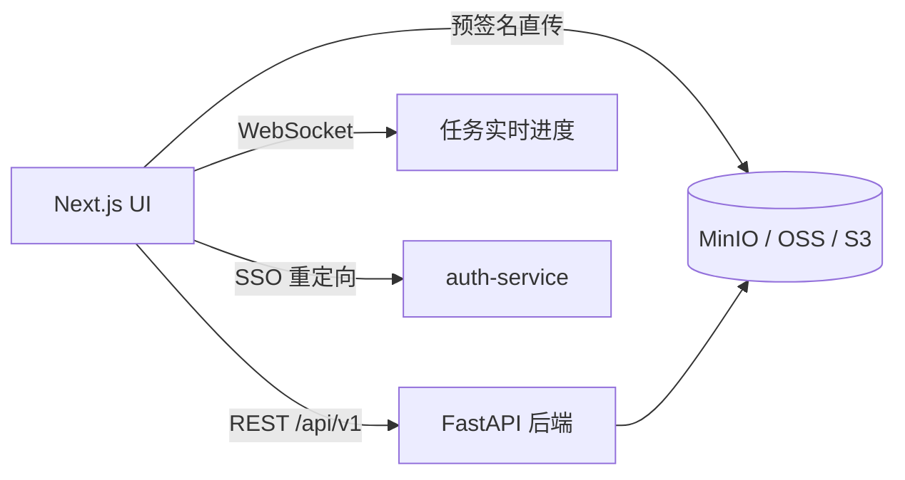

# AI 音视频助手 · 前端

[](https://github.com/HyxiaoGe/ai-audio-assistant-ui/actions/workflows/build-and-deploy.yml)


[English](README_EN.md)

把上传的音视频文件或 YouTube 链接,转成**可核验、可复用、可发现**的结构化理解 —— 带时间戳的转写、结构化摘要、关键要点、待办与配图,并实时推送进度。

这是产品的**前端**(Next.js);后端为独立的 FastAPI 应用 [`ai-audio-assistant-web`](https://github.com/HyxiaoGe/ai-audio-assistant-web),ASR/LLM、存储、数据库等业务逻辑都在后端。本仓只负责界面、OAuth 登录流、客户端文件哈希与对象存储直传;鉴权、提示词等经共享服务打通。

## 功能特性

以下均为代码中已落地的前端能力:

- **登录与会话** —— 经共享 SSO SDK [`auth-client-web`](https://github.com/HyxiaoGe/auth-client-web) 重定向到 auth-service 完成 Google/GitHub OAuth;登录态驱动导航与受保护路由(`src/middleware.ts`)。
- **上传体验** —— 客户端 SHA256 计算 + 预签名直传对象存储(MinIO/OSS/S3);命中已有内容秒传提示、失败重试。
- **YouTube / 发现页** —— 粘贴链接直接转写;`/discover` 关键词搜索 + 热门推荐,对「已有转写」的结果感知并跳转。
- **公开广场 `/explore`** —— 匿名浏览管理员公开的已完成任务及其转写/摘要。
- **任务面板** —— 列表、筛选、状态徽章、失败重试与清理。
- **详情视图** —— 时间轴转写、分区摘要、关键要点 / 行动项、AI 配图渐进式呈现。
- **实时进度** —— WebSocket 推送,断线自动重连并降级为 HTTP 轮询。
- **转写内检索** —— 复用后端全文检索(关键词/字面匹配),命中片段高亮并深链到时间点。
- **管理后台 `/admin`** —— 屏蔽频道复核、成本看板等,受权限门控。
- **国际化** —— 中英切换;API 错误文案由后端本地化后直显。

## 架构概览

| 层 | 技术 / 说明 |
|------|-------------|
| 框架 | Next.js 16(App Router)+ React 19 + TypeScript 5 |
| UI | Tailwind CSS v4 + shadcn/ui + Radix UI;`--app-*` token 为唯一样式源(见 `CLAUDE.md`「样式与组件契约」) |
| 鉴权 | 共享 SSO SDK `auth-client-web` 重定向 auth-service 完成 OAuth,令牌存 localStorage。`next-auth` 仍在 `package.json` 但为**历史残留依赖**,主流程不经它 |
| 状态 | Zustand(客户端全局态)+ React Server Components |
| 实时 | 原生 WebSocket(进度推送,自动重连 / 轮询降级) |
| 主题 | next-themes(明 / 暗) |
| 测试 | Vitest + Testing Library |

**数据流**:


```mermaid
flowchart LR
  UI[Next.js UI] -->|REST /api/v1| BE[FastAPI 后端]
  UI -->|WebSocket| WS[任务实时进度]
  UI -->|预签名直传| S3[(MinIO / OSS / S3)]
  UI -->|SSO 重定向| AUTH[auth-service]
  BE --> S3
```

前端职责:界面、OAuth 登录流、客户端文件哈希、对象存储直传、展示后端错误。前端**不**校验 JWT、**不**生成预签名、**不**直连 ASR/LLM、**不**做数据库操作。

## 快速开始

### 环境要求

- **Node.js 20+** 与 **npm**
- 运行中的后端 [`ai-audio-assistant-web`](https://github.com/HyxiaoGe/ai-audio-assistant-web)(默认 `http://localhost:8088`)与 auth-service(默认 `http://localhost:8100`)

### 本地开发

```bash
npm install
cp .env.example .env.local   # 按需填写
npm run dev                  # 打开 http://localhost:3000
```

### 环境变量

复制 `.env.example` 为 `.env.local` 后按需调整。所有前端可见变量均以 `NEXT_PUBLIC_` 开头。

| 变量名 | 说明 | 示例 |
|--------|------|------|
| `NEXT_PUBLIC_APP_URL` | 前端访问地址 | `http://localhost:3000` |
| `NEXT_PUBLIC_API_BASE_URL` | 后端 API 基址 | `http://localhost:8088/api/v1` |
| `NEXT_PUBLIC_API_URL` | 后端源站(WebSocket / 媒体) | `http://localhost:8088` |
| `NEXT_PUBLIC_AUTH_URL` | auth-service 地址 | `http://localhost:8100` |
| `NEXT_PUBLIC_AUTH_CLIENT_ID` | 本应用在 auth-service 注册的 client id | `app_your_client_id` |

## 质量门禁与测试

```bash
npm run lint       # ESLint(eslint src)—— 含样式契约的 no-restricted-syntax 规则
npm run test       # Vitest 单元测试
npm run build      # 生产构建
npx tsc --noEmit   # 类型检查
```

CI(`.github/workflows/build-and-deploy.yml` 的 build job)构建镜像;部署 job(`deploy-dev`)仅在 `master` 触发,**纯文档改动经 `paths-ignore` 跳过整条流水线**。提交时 husky + lint-staged 会对暂存文件自动跑 ESLint。

## 目录结构

```
src/
├── app/
│   ├── (auth)/login/    # 登录页(公开)
│   ├── auth/callback/   # SSO 回调(公开)
│   ├── (main)/          # 受保护路由(tasks / explore / discover / admin / settings / stats …)
│   └── globals.css      # Tailwind v4 主题(--app-* token)
├── components/          # ui/(shadcn,勿改) · common · task · layout
├── lib/                 # api-client.ts(统一 API 客户端) · auth-sdk.ts(SSO 引导)
├── hooks/ · store/      # React hooks · Zustand stores
├── locales/ · types/    # i18n 文案 · TypeScript 类型
└── middleware.ts        # 受保护路由的登录门
```

> 样式与组件约定(`--app-*` token 唯一样式源、用 `className` 任意值类不用内联 `style={{}}`、交互用 `<Button>` 原语、`ui/` 勿改)见 `CLAUDE.md`「样式与组件契约」。

## 文档索引

| 文档 | 位置 | 说明 |
|------|------|------|
| 工程约定 | `CLAUDE.md` | 样式与组件契约、目录约定 |
| 前端架构 | `docs/ARCH.md` | 架构与数据流 |
| 接口契约 | `docs/API.md` | 前端消费的后端接口 |
| 前端职责 | `docs/FE.md` | 前后端边界 |
| 产品需求 | `docs/PRD.md` | 产品目标与范围 |
| 环境变量样例 | `.env.example` | 前端环境变量 |

---

English version: [README_EN.md](README_EN.md)
