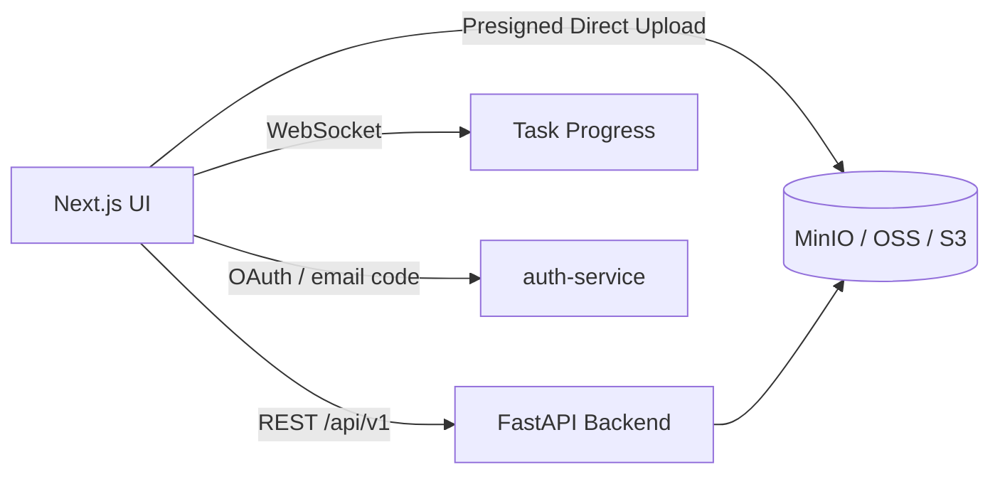

# AI Audio Assistant · Frontend

[](https://github.com/HyxiaoGe/ai-audio-assistant-ui/actions/workflows/build-and-deploy.yml)


[中文](README.md)

Turn uploaded audio/video files or YouTube links into **verifiable, reusable, discoverable** structured understanding — timestamped transcripts, structured summaries, key points, action items, and illustrations, with real-time progress.

This is the **frontend** (Next.js). The backend is a separate FastAPI app, [`ai-audio-assistant-web`](https://github.com/HyxiaoGe/ai-audio-assistant-web), where ASR/LLM, storage, and database logic live. This repository only handles the UI, OAuth/email verification-code login flows, client-side file hashing, and presigned direct upload; auth, prompts, and other shared concerns go through shared services.

## Features

All of the following are implemented in the frontend codebase:

- **Login & session** — shared SSO SDK [`auth-client-web`](https://github.com/HyxiaoGe/auth-client-web) integrates with auth-service for Google/GitHub OAuth and passwordless email verification-code login; session state drives navigation and protected routes (`src/middleware.ts`).
- **Upload UX** — client-side SHA256 hashing + presigned direct upload to object storage (MinIO/OSS/S3); instant-upload hint on content match, retry on failure.
- **YouTube / discover** — transcribe by pasting a link; `/discover` keyword search + trending recommendations, aware of already-transcribed results and deep-linking to them.
- **Public explore `/explore`** — anonymously browse admin-published completed tasks with their transcripts/summaries.
- **Task dashboard** — list, filter, status badges, retry and cleanup of failed tasks.
- **Detail view** — timeline transcript, sectioned summary, key points / action items, progressively rendered AI illustrations.
- **Real-time progress** — WebSocket push with auto-reconnect and graceful fallback to HTTP polling.
- **In-transcript search** — reuses backend full-text search (keyword/lexical), highlights hit snippets and deep-links to timestamps.
- **Admin console `/admin`** — channel-blocklist review, cost dashboard, etc., permission-gated.
- **i18n** — English/Chinese switch; API error messages localized by the backend and shown directly.

## Architecture

| Layer | Tech / Notes |
|-------|--------------|
| Framework | Next.js 16 (App Router) + React 19 + TypeScript 5 |
| UI | Tailwind CSS v4 + shadcn/ui + Radix UI; `--app-*` tokens are the semantic source for colors, backgrounds, and borders (see `AGENTS.md`, "Design System Review Rules") |
| Auth | Shared SSO SDK `auth-client-web` integrates with auth-service for OAuth and email verification-code login, with tokens in localStorage. `next-auth` is still in `package.json` but is a **residual dependency**; the main flow does not use it |
| State | Zustand (client global state) + React Server Components |
| Real-time | Native WebSocket (progress push, auto-reconnect / polling fallback) |
| Theme | next-themes (light / dark) |
| Testing | Vitest + Testing Library |

**Data flow**:



Frontend responsibilities: UI, OAuth/email verification-code login flows, client-side file hashing, direct upload, and rendering backend errors. The frontend does **not** verify JWTs, generate presigned URLs, call ASR/LLM directly, or touch the database.

## Quick Start

### Prerequisites

- **Node.js 20+** and **npm**
- A running backend [`ai-audio-assistant-web`](https://github.com/HyxiaoGe/ai-audio-assistant-web) (default `http://localhost:8088`) and auth-service (default `http://localhost:8100`)

### Local development

```bash
npm install
cp .env.example .env.local   # fill in as needed
npm run dev                  # open http://localhost:3000
```

### Environment variables

Copy `.env.example` to `.env.local` and adjust as needed. All frontend-visible variables are prefixed with `NEXT_PUBLIC_`.

| Variable | Description | Example |
|----------|-------------|---------|
| `NEXT_PUBLIC_APP_URL` | Frontend URL | `http://localhost:3000` |
| `NEXT_PUBLIC_API_BASE_URL` | Backend API base | `http://localhost:8088/api/v1` |
| `NEXT_PUBLIC_API_URL` | Backend origin (WebSocket / media) | `http://localhost:8088` |
| `NEXT_PUBLIC_AUTH_URL` | auth-service URL | `http://localhost:8100` |
| `NEXT_PUBLIC_AUTH_CLIENT_ID` | This app's client id registered in auth-service | `app_your_client_id` |

## Quality Gates & Testing

```bash
npm run lint       # ESLint (eslint src) — includes design-contract no-restricted-syntax rules
npm run test       # Vitest unit tests
npm run build      # production build
npx tsc --noEmit   # type check
```

CI (the build job in `.github/workflows/build-and-deploy.yml`) builds the image; the deploy job (`deploy-dev`) only runs on `master`, and **doc-only changes skip the whole pipeline via `paths-ignore`**. On commit, husky + lint-staged run ESLint over staged files.

## Project Structure

```
src/
├── app/
│   ├── (auth)/login/    # login page (public)
│   ├── auth/callback/   # SSO callback (public)
│   ├── (main)/          # protected routes (tasks / explore / discover / admin / settings / stats …)
│   └── globals.css      # Tailwind v4 theme (--app-* tokens)
├── components/          # ui/ (shadcn, do not modify) · common · task · layout
├── lib/                 # api-client.ts (unified API client) · auth-sdk.ts (SSO bootstrap)
├── hooks/ · store/      # React hooks · Zustand stores
├── locales/ · types/    # i18n copy · TypeScript types
└── middleware.ts        # login gate for protected routes
```

> The design-system contract (`--app-*` tokens as the semantic source for colors, backgrounds, and borders; the existing Tailwind spacing scale for layout; arbitrary-value `className` over inline `style={{}}`; the `<Button>` primitive for interactions; and `ui/` left untouched) is documented in `AGENTS.md` under "Design System Review Rules".

## Docs

| Doc | Location | Notes |
|-----|----------|-------|
| Engineering & review guide | `AGENTS.md` | project structure, workflow, design system, and Code Review rules |
| Contributing | `CONTRIBUTING.md` | dev workflow and commit conventions |
| Testing strategy | `docs/TESTING.md` | Vitest + Testing Library |
| Env var sample | `.env.example` | frontend environment variables |

> `CLAUDE.md` remains a local tool-support file; the public, reviewable engineering contract is `AGENTS.md` together with `README.md`.

---

中文版: [README.md](README.md)
